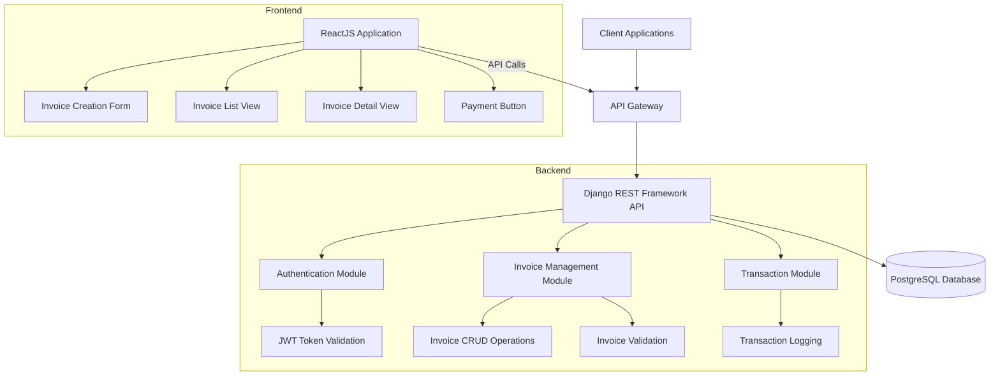
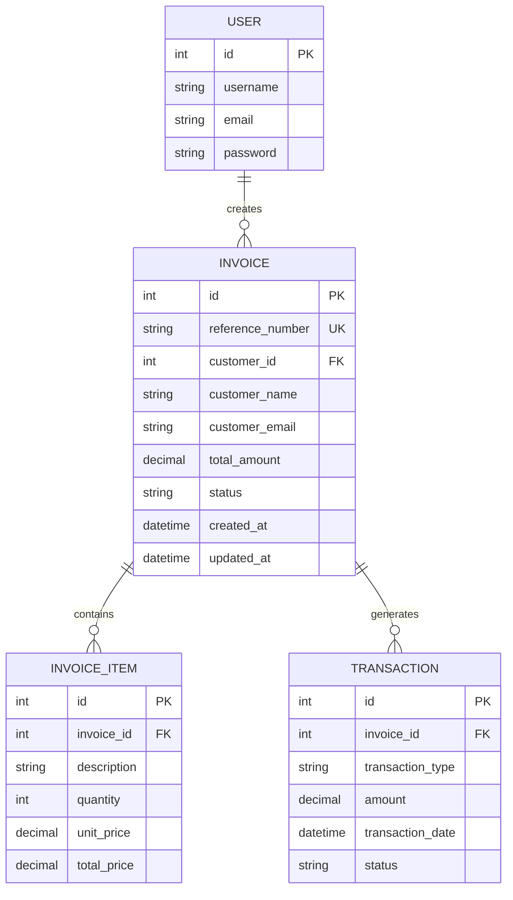
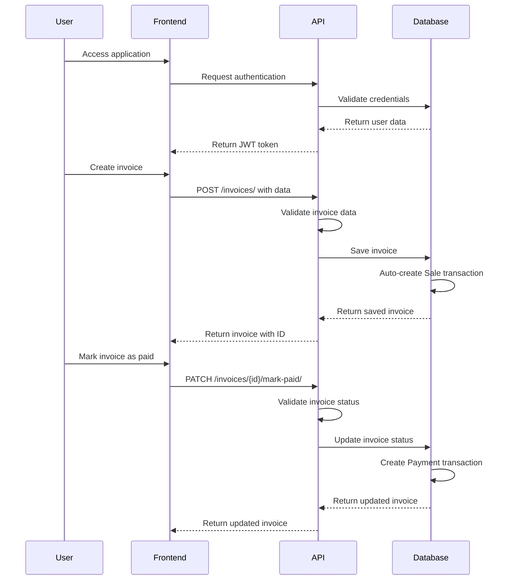

# System Design Document

## Overview
This document outlines the system design for a backend system that manages sales invoices and records related transactions using Django and Django REST Framework, with an optional ReactJS frontend.

## Requirements

### Backend Requirements (Django + DRF)
- Use Django and Django REST Framework
- Implement token-based authentication (JWT)
- Only authenticated users should access invoice APIs

### Core Features
1. **Invoice Creation**
   - Create new invoices with customer details and invoice items
   - Auto-calculate total amount from items
   - Validate that each invoice has at least one item
   - Ensure each invoice has a unique reference/number
   - Record a Sale transaction when an invoice is created

2. **Invoice Listing & Retrieval**
   - List all invoices
   - View details of a single invoice

3. **Invoice Payment**
   - Mark invoices as paid
   - Only allow payment if invoice is in Pending status
   - Record a Payment transaction when an invoice is paid
   - Update payment status correctly

4. **Transactions**
   - Record Sale transaction when invoice is created
   - Record Payment transaction when invoice is paid

### Business Logic
- Total amount should be auto-calculated from items
- Invoice must have at least one item
- Payment should only be allowed if the invoice is in Pending status
- Totals should always match with items

### Validation Rules
- Each invoice must have unique reference/number
- Totals cannot be negative
- Payment status must update correctly

### Frontend Requirements (ReactJS with TypeScript)
- Create invoice form
- List invoices in a table
- View invoice details
- Button to mark invoice as paid

## System Architecture

## Database Design

## API Endpoints

### Authentication
- POST `/api/auth/login/` - User login
- POST `/api/auth/logout/` - User logout

### Invoices
- GET `/api/invoices/` - List all invoices
- POST `/api/invoices/` - Create new invoice
- GET `/api/invoices/{id}/` - Retrieve invoice details
- PUT `/api/invoices/{id}/` - Update invoice
- PATCH `/api/invoices/{id}/mark-paid/` - Mark invoice as paid

### Transactions
- GET `/api/transactions/` - List all transactions
- GET `/api/transactions/{id}/` - Retrieve transaction details

## Data Flow

## Implementation Plan

1. Set up Django project with DRF
2. Implement authentication system with JWT
3. Create Invoice and related models
4. Develop Invoice CRUD API endpoints
5. Implement transaction recording logic
6. Add validation and business logic
7. Create database migrations
8. Write API documentation
9. Develop minimal test coverage
10. (Optional) Build ReactJS frontend
11. Prepare deployment and documentation